# EMI 2026 Final Project Weblog

**Video:** ***https://youtu.be/q7ub6Pivkgg*** **Including the interaction method and the code running & tech**


## Project Introduction

**Beauty Has No Definition** is an interactive machine learning prototype created using p5.js, ml5.js FaceMesh and ml5 neuralNetwork classifiers.

The project consists of three aesthetic systems: the Black System, the Yellow System and the Blue System. The Black System defines beauty through structured and three-dimensional facial features, such as sharp contours, larger eyes and a higher nose bridge. The Yellow System defines beauty through naturalness, softness and a minimalist visual style. The Blue System defines beauty through individuality, expression, colour and emotional presence.

Users stand in front of a live camera and can press keys 1, 2 and 3 to change the order of the three systems. If a system determines that a particular facial feature (the eyes, nose or mouth) does not match its aesthetic preset, it replaces that part of the face with a collage image that represents what the system considers beautiful. If the features fit the system’s standard, no replacement will be applied. Through the interaction, users gradually realise that different systems can have completely different definitions and judgements of the same person's facial features.

Through this project, I hope to show that beauty should not be defined by a single algorithm or by other people's standards. Everyone has different ideas about beauty, and we should be able to form our own understanding of it. Beauty has no definition.

## 1, 🟥 14 May - 15 May Research - Theme Selection

### By the end of this stage, I had established the main direction of my project. 

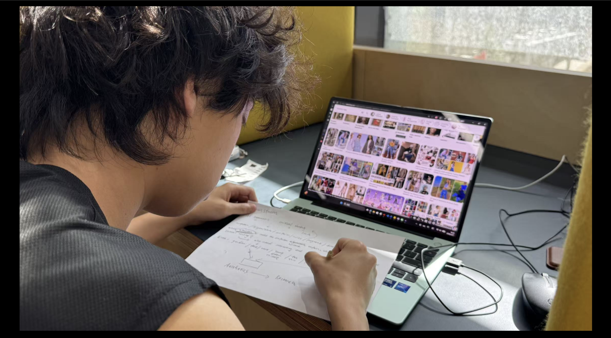

After reading the basic requirements for the final project, I started to define the direction of my work. I realised that the project should not only be a visual experiment, but also needs to respond to two important aspects: AI interaction and critical thinking. 

On one side, I want to explore how a participant can interact with a machine learning system. 
At the same time, I wanted this project to encourage critical reflection on issues that exist in society.

Therefore, I began to break down my topic through two key words: 

**AI interaction and critical exploration**

### Brainstorm

In the second stage of defining my project direction, I started brainstorming around two key words: **AI Interaction** and **Critical Thinking**. 

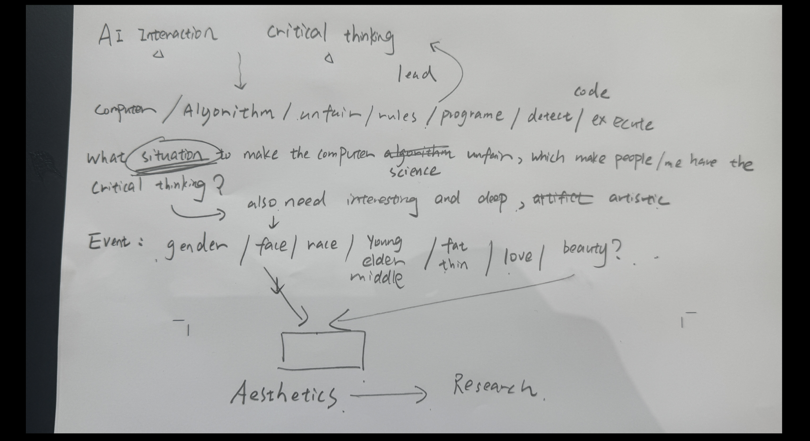

🟪 I first looked at the idea of the “computer system” itself, including algorithms, rules, data, labels and execution processes. A computer often appears to be an objective system because it simply follows instructions. However, I began to question whether this objectivity really exists. If the rules and datasets behind an algorithm are created by humans, then the system may also contain hidden bias, unfairness and discrimination that people do not always notice.

🟪 Then I expanded the idea of unfairness into different areas, such as gender, race, age, body shape, face, beauty and even love. Among these keywords, I found that many of them were connected to the body and appearance, especially beauty, body shape and facial features. This made me realise that a computer’s judgement of beauty is not naturally produced. It is guided by standards defined by its creators.

🟪 In other words, if a creator believes that big eyes, double eyelids, smooth skin and symmetrical facial features are beautiful, then the model may also learn to recognise these features as “beautiful”. If the creator ignores individuality, exaggerated styling, unconventional facial features or strong self-expression, then these forms of beauty may be excluded from the system’s standard.

🟪 This made me to think that the real question is not simply whether a computer can judge beauty, but: **who defines beauty for the machine?** When an algorithmic model presents a particular aesthetic standard as an objective judgement, it may influence how users understand their own appearance. It may even make users believe that they need to move closer to the system’s standard in order to be considered beautiful. This kind of judgement could lead to emotional fluctuation, self-doubt and appearance anxiety.

**However, This is still only my early assumption, so my next step is to carry out secondary research. I want to look for real examples and discussions about algorithmic bias, Beauty judgement and facial analysis systems, in order to understand whether this concern has appeared in existing cases.**

## 2, 🟥 18 May - 20 May Research - Theme Confirm

***At this stage, I moved into secondary research. My aim was not only to verify my initial idea, but also to deepen the critical context of the project and look for new points of innovation.***

🟪 The first case is Beauty.AI, an AI-judged beauty contest. The results were criticised because most winners were white and only one winner had dark skin. This case is directly related to my topic because it shows how algorithmic beauty judgement can repeat biased standards rather than objectively define beauty.

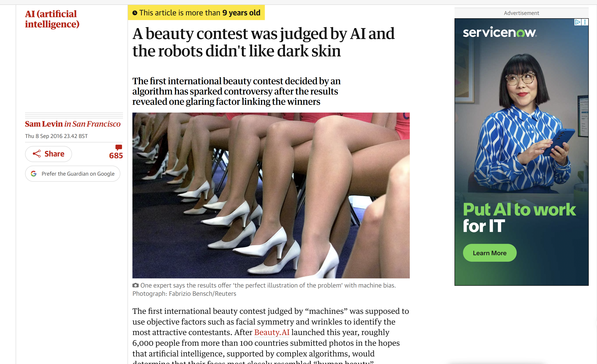

*https://www.theguardian.com/technology/2016/sep/08/artificial-intelligence-beauty-contest-doesnt-like-black-people*


🟪 The second case is Gender Shades by Joy Buolamwini and Timnit Gebru. Their research showed that commercial facial classification systems had much higher error rates for darker-skinned women than for lighter-skinned men. Although this case is about facial classification rather than beauty, it shows that computer vision systems do not read all faces equally.


*https://proceedings.mlr.press/v81/buolamwini18a.html*


🟪 The third direction is research on AI beauty filters and appearance anxiety. Some studies suggest that digital beautification and AI filters can influence users’ self-perception and increase appearance-related anxiety. This connects to my concern that algorithmic beauty systems may affect how users understand their own appearance.

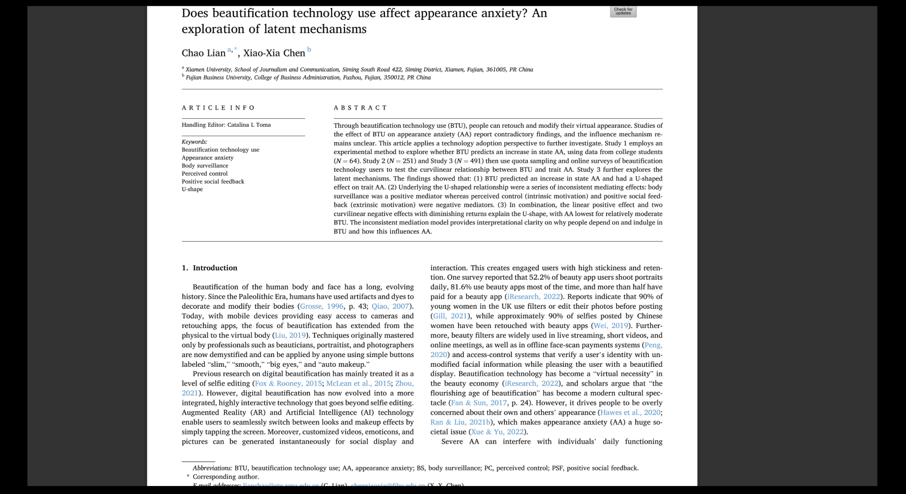


*https://www.sciencedirect.com/science/article/pii/S0747563223001449*

🟪 At the end of this stage, I found that artificial intelligence and computer algorithms can indeed involve biased judgements towards faces, bodies, beauty and identity-related features. Although these systems may appear to conduct objective analysis, they often rely on human-defined data, labels, rules and aesthetic standards. Through cases such as Beauty.AI, Gender Shades, and research on AI beauty filters, I realised that algorithms may not only reproduce existing aesthetic biases, but also influence how users understand their own appearance and emotional state.

🟪 Therefore, I further defined my project theme around algorithmic beauty. 

### Through this project, I hope to make people realise that computers do not truly understand beauty or ugliness. Instead, they generate seemingly objective aesthetic judgements based on rules, features and labels defined by their creators. Real beauty should not be defined by a single system or others people, but should be shaped by individual expression, choice and feeling. Colourful, personal, exaggerated and non-standard forms of appearance can all be part of beauty.

## 3, 🟥 21 May Course Knowledge Connection

At this stage, my project theme had already been established as Beauty Error: Beauty is a Preset. Therefore, my focus was no longer on finding the topic itself, but on understanding how this topic could connect with the machine learning concepts I had learned in class.

In Week 4, we learned about the idea of features. A machine learning model does not directly understand an object or a concept. Instead, it receives a set of measurable numerical features and uses these values to produce an output. This helped me rethink my project theme. If a computer appears to judge beauty or ugliness, it is not truly understanding beauty. It is breaking the face down into measurable and classifiable features, such as eye size, facial symmetry, skin smoothness, expression intensity, colour, decoration, or the position of the face in front of the camera.

This also made me realise that my project should not simply become three visual filters. The three beauty systems should be understood as three different algorithmic preset systems. Each system focuses on different facial features and produces a different “ideal beauty” result according to creator-defined rules. For example, one system may focus on eye size and symmetry, and therefore enlarge the eyes or smooth the skin. Another system may focus on softness and a gentle expression. A third system may focus on colour, decoration and individuality, producing a more expressive and non-standard visual output.

Through this connection, I further clarified the machine learning logic of my project. The same face will first be translated into a set of features, and these features will then be interpreted by three different aesthetic preset systems. The difference in output does not come from the participant changing, but from the different feature weights, rules and aesthetic assumptions behind each system.

This helped me organise the core structure of the project:

Same face → facial feature extraction → three aesthetic preset systems → three different visual outputs.

This stage helped me move from a critical concept of algorithmic beauty to a more specific technical direction. The project will use code, camera input, feature extraction and preset logic to show how computers can turn beauty into measurable features and rules. In the next stage, I will look at interaction case studies and think about how this machine learning logic can become a clearer and more immersive interaction.

## 4, 🟥 25 May - 26 May Interaction Technology

***After finalizing the theme, I conducted case studies at this stage to explore what types of interaction and visual presentation can help audiences better perceive my core idea: beauty should not be defined by algorithms.***

### Case Study 1


The first case study is Memo Akten’s *Learning to See*. This work uses machine learning and a live camera feed to reinterpret real-world objects in real time. The system does not simply show what is in front of the camera; instead, it transforms the live input through what the neural network has already learned.

*https://www.memo.tv/works/learning-to-see/*

### Case Study 2 — Rafael Lozano-Hemmer and Krzysztof Wodiczko, *Zoom Pavilion*

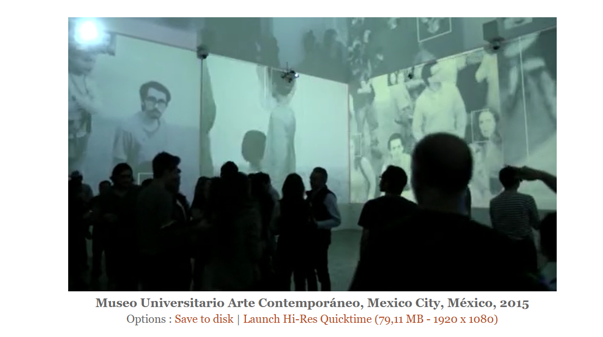

The second case study is *Zoom Pavilion* by Rafael Lozano-Hemmer and Krzysztof Wodiczko. This installation uses surveillance systems, face recognition and spatial tracking to detect participants and record their spatial relationships within the exhibition space.

*https://www.lozano-hemmer.com/zoom_pavilion.php*

### Case Study 3 — Zach Blas, *Facial Weaponization Suite*

The third case study is Zach Blas’s *Facial Weaponization Suite*. This project critiques biometric facial recognition by using facial data to create collective masks. The work shows that the face is not just a neutral image; it can become data that is measured, classified and controlled by technical systems.

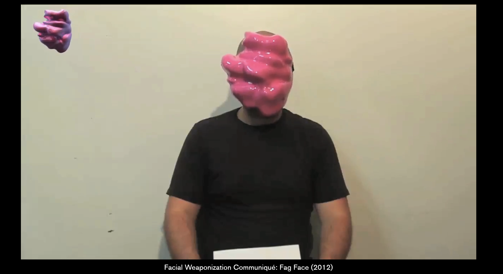

*https://zachblas.info/works/facial-weaponization-suite/*

### Summary

🟪 Through an analysis of these three cases, I further identified how to bridge my conceptual ideas with interactive technologies. Learning to See made me realise that machine vision is far from objective, as it is shaped by training datasets and pre-existing knowledge. Zoom Pavilion demonstrated that cameras can function as a spatial interactive system, rather than merely a recording device. Meanwhile, Facial Weaponization Suite helped me understand that human faces can be converted by technological systems into measurable, classifiable, maskable and reconstructable data objects.

### I then considered integrating these insights into my final project. For instance, could I combine space captured by camera lenses with real-time facial transformations to create engaging visuals and interactive experiences?

🟪 After thorough reflection, I settled on the following interaction design:
Participants stand in front of a live camera. Their facial features will be interpreted simultaneously by three distinct algorithmic aesthetic presets, generating three altered versions of their face on display.

**Black System** defines beauty through structured and three-dimensional facial features, such as sharp contours, larger eyes and a higher nose bridge.
**Yellow System** defines beauty through softness, naturalness and a minimal visual style.
**Blue System** defines beauty through individuality, expression, colour and emotional presence.

### Through this method, the participant can understand that each system’s standard of beauty is different, and that we cannot simply listen to the system’s opinion. In other words, we do not need to listen to other people’s opinions in life. As long as we feel that something is beautiful, then it is beautiful. Beauty has no fixed definition.

<a id="webcam-layout-test"></a>
## 5, 🟥 27 May Technical Test 1 — Webcam and Visual Layout Test

In this stage, I started the first technical test of the project. The aim was not to build the final machine learning system yet, but to test whether the live webcam input and three-panel visual layout could work.

I used p5.js to create a live camera feed and displayed the same input in three different panels. At this point, the visual effects are only simple overlays, used to test how the face image could be changed on screen. They do not yet represent the final aesthetic preset systems.

This first prototype tested the early structure of the project:

**same camera input → multiple system views → different visual responses**

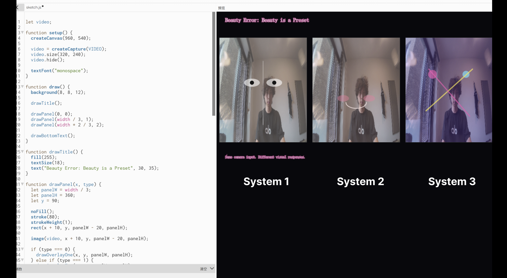

**Next, I placed the three systems into one main interface, where the same face is divided and processed by three different systems.**

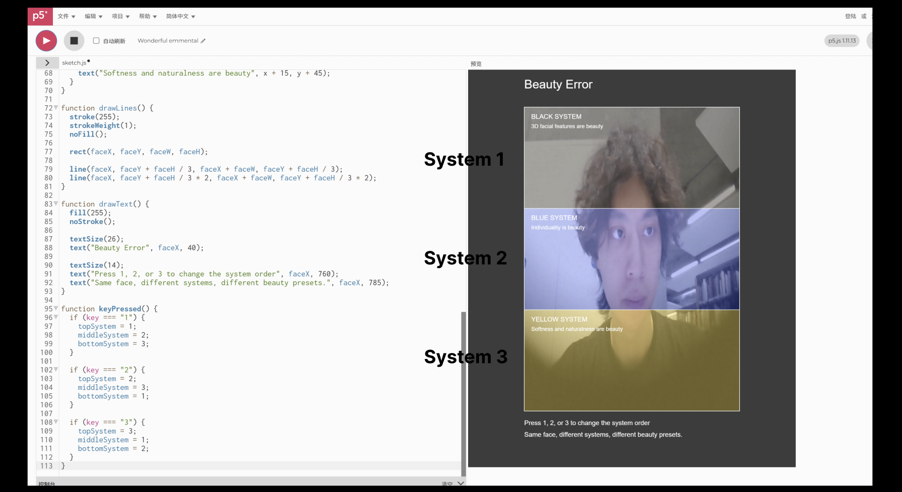


<a id="black-system-facemesh"></a>
## 6, 🟥 29 - 30 May Black System: FaceMesh Landmark Detection Test

At this stage, I used FaceMesh to build the facial feature detection method for the Black System. 

The Black System defines “beauty” as three-dimensional and clearly structured facial features, such as more prominent eyes, a higher nose bridge and a sharper facial contour. Therefore, I did not ask the system to directly judge real beauty or ugliness. Instead, I first used FaceMesh to detect facial landmark points from the live camera input.

Technically, I selected landmark points related to the eyes, nose and mouth, and converted these points into simple features that the system could read, such as eye width, nose position, mouth position and the approximate proportion of facial features. This connects to the course content on feature extraction: the system first extracts features from an image, and then makes a judgement based on those features.

In the Black System, these features are used for a simple rule-based judgement. If the detected facial features do not match the Black System’s preset beauty standard of being “three-dimensional, sharp and structured”, the system adds or replaces collage-style facial images in the corresponding positions. This process is not intended to prove what true beauty is, but to show how a system can reinterpret the same face according to human-defined rules.

**The Reference**

*https://editor.p5js.org/ml5/sketches/lCurUW1TT?*

ml5.js FaceMesh keypoints example

*https://developers.google.com/edge/mediapipe/solutions/vision/face_landmarker*

MediaPipe Face Landmarker official documentation

I selected a few key code snippets to show how the Black System works.

````

faceMesh = ml5.faceMesh(options)

faceMesh.detectStart(video, gotFaces)

````

These lines load FaceMesh and start detecting facial landmarks from the live camera.

````

drawBlackEyeTest()

drawBlackNoseTest()

drawBlackMouthTest()

````

These functions test the eyes, nose and mouth separately.

````

averageEyeRatio = (leftRatio + rightRatio) / 2

noseRatio = noseLength / noseWidth

mouthRatio = mouthWidth / mouthHeight

````

These values turn facial landmarks into simple features that the system can read.


````
replaceEye(...)

replaceNose(...)

replaceMouth(...)

````

If the user features do not match the Black System preset, the system replaces the related facial area with collage images.

**Final Test for Black System**

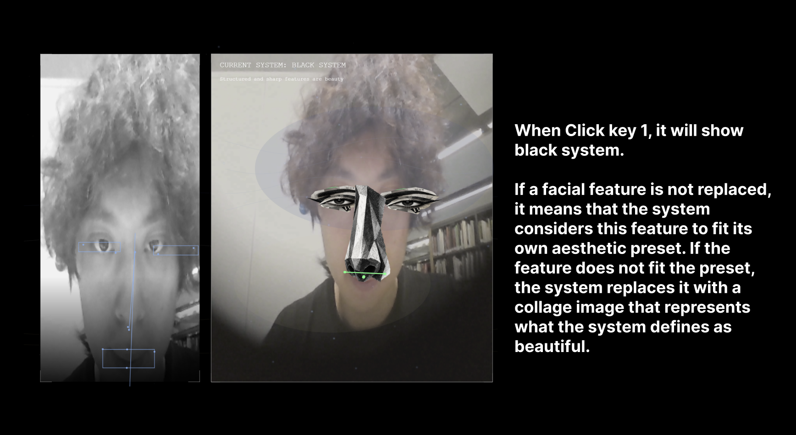


<a id="blue-system-feature-comparison"></a>
## 7, 🟥 31 May / 3 June Blue System: Dataset Preparation and Feature Comparison

### After completing the FaceMesh feature detection for the Black System, I began developing the Blue System. Unlike the Black System, the Blue System is not based on facial landmark points and rule-based judgements. Instead, it uses a classification model trained with ml5 neuralNetwork.

The Blue System defines “beauty” through individuality, self-expression, emotional presence and strong visual impact.

Therefore, I prepared a small image dataset for this system and divided the images into two categories: expressive and not_expressive. Each category contained approximately 20 images.

> **Note:** All images in the Blue System and Yellow System training datasets were generated using AI image generation tools. I created them by writing prompts based on each system’s aesthetic preset and, in some cases, providing reference images to guide the visual style. After generation, I selected and labelled the images according to the logic of each system, such as expressive / not_expressive for the Blue System and natural / not_natural for the Yellow System. 
>


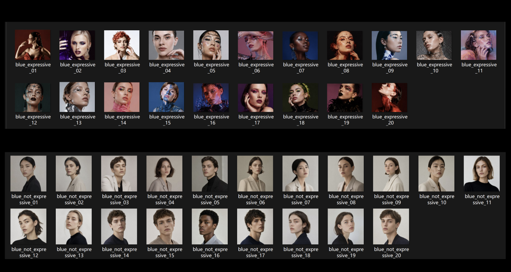

This stage connects to the course and project requirement of data selection and preparation. What the model can learn depends heavily on how I choose the images and define the labels. In this system, expressive is not an objective standard, but an aesthetic preset that I defined for the Blue System.

### Technically, I did not ask the model to understand the whole image directly. Instead, I first extracted several simple visual features from each image, such as brightness, saturation, contrast and colour difference. I then used these features as inputs to train an ml5 neuralNetwork classification model.

````
getImageFeatures()

````


During this process, I conducted a simple comparison experiment to find a more effective way of training the model.

For the first experiment, I used only brightness and saturation as the input features.

However, in the second experiment, I incorporated contrast and colour difference, resulting in a model trained using four input features.


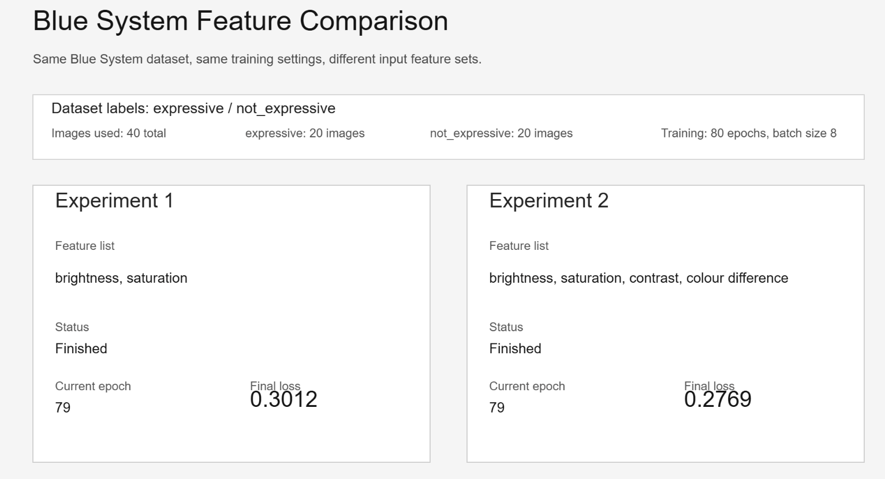


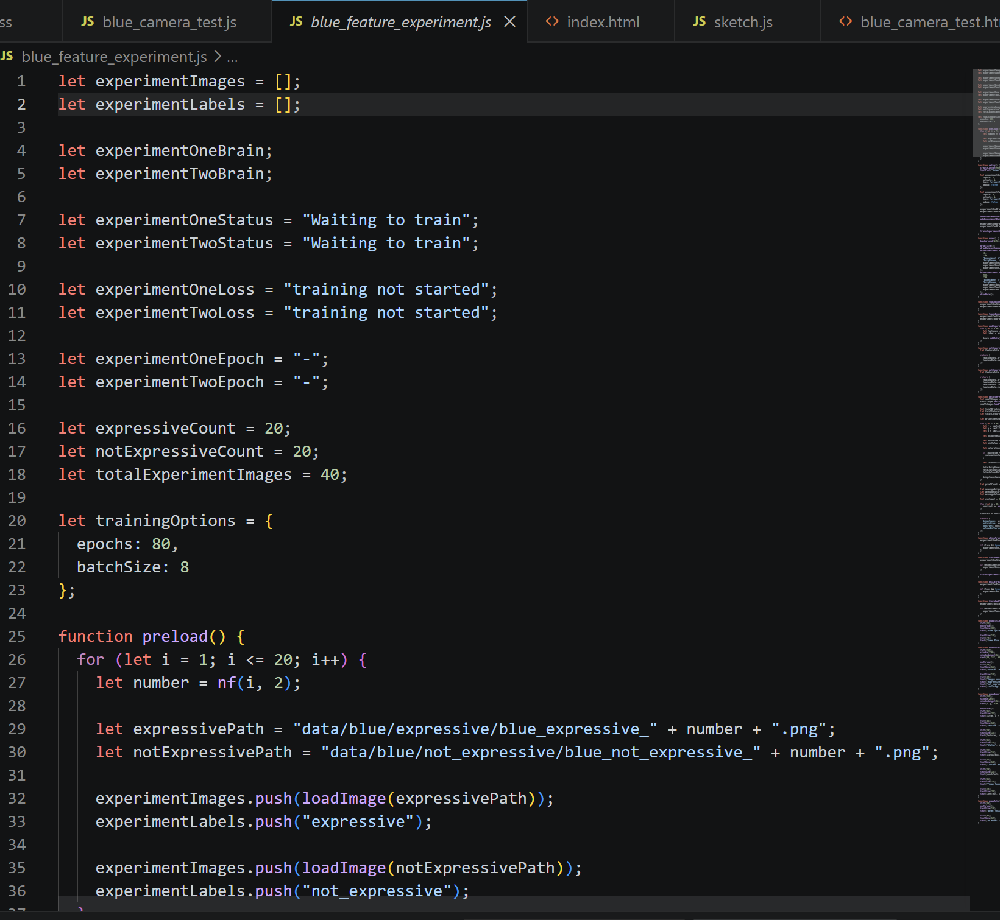


````
features = [brightness, saturation]

Uploading d0c9a9167cd1fd1925eec634378e41f1_raw.mp4…


features = [brightness, saturation, contrast, colourDifference]

````

By comparing the training results of the two experiments, I found that the four-feature version was more stable. Experiment 1 used only brightness and saturation, with a final loss of 0.3012. After adding contrast and colour difference in Experiment 2, the final loss decreased to 0.2769. Therefore, I chose brightness, saturation, contrast and colour difference as the input features for the Blue System classifier. This choice also better matches the Blue System’s aesthetic logic of individuality, expression, colour and visual intensity.

**This stage helped me move from the Black System’s rule-based judgement towards the Blue System’s trained classifier. Through the feature comparison, I also realised that the classifier’s judgement is not objective, but is shaped by the data, labels and input features that I chose.**


<a id="blue-classifier-webcam-test"></a>
## 8, 🟥 4 June Blue System: Classifier Training and Webcam Test

### At this stage on 4 June, I completed the Blue System model training and then carried out a live webcam test. This resulted in a Blue System webcam test, where the trained model could work with real-time camera input.

**1, The training process of the Blue System classifier.**


**2, After training the classifier, I carried out a live webcam test to check whether the trained model could process real-time camera input and produce classification results.**

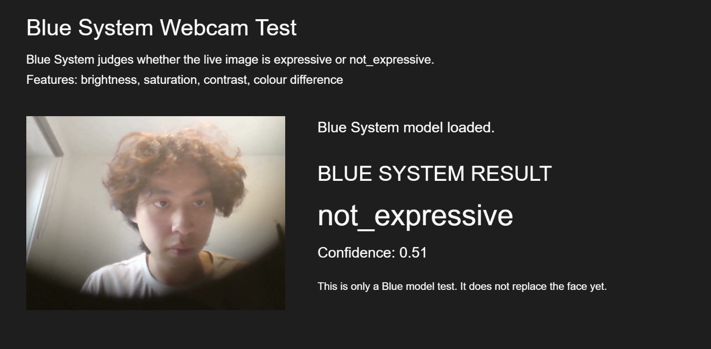

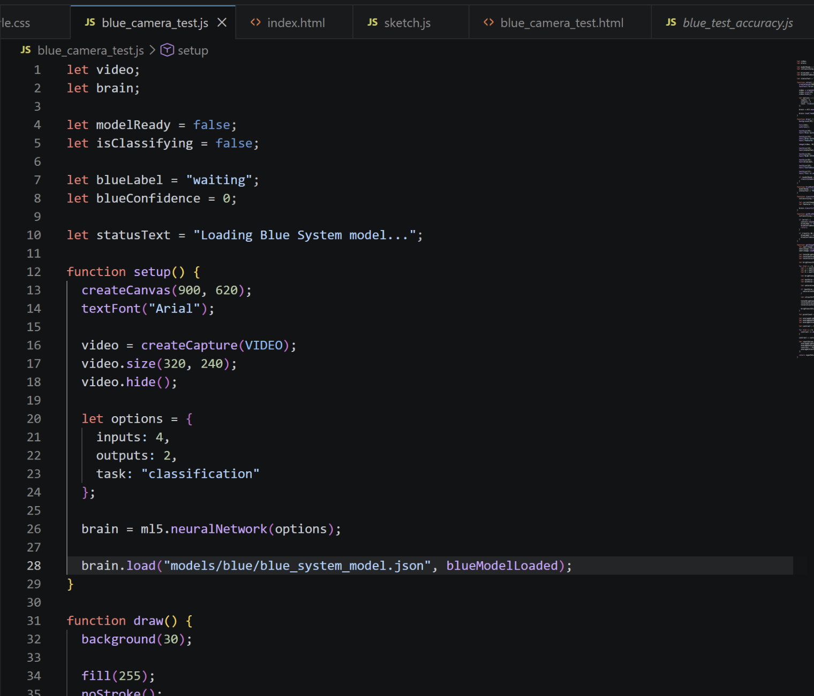


**3, After confirming that the trained Blue System model could work with live webcam input, I then connected this classifier back into the main project interface. This allowed the Blue System result to influence the final visual output, rather than remaining as a separate testing page.**

### When the Blue System classifies the live camera image as not_expressive, meaning that the result does not match its expressive beauty preset, the system triggers a corresponding collage-style visual replacement and replaces the user’s facial features.

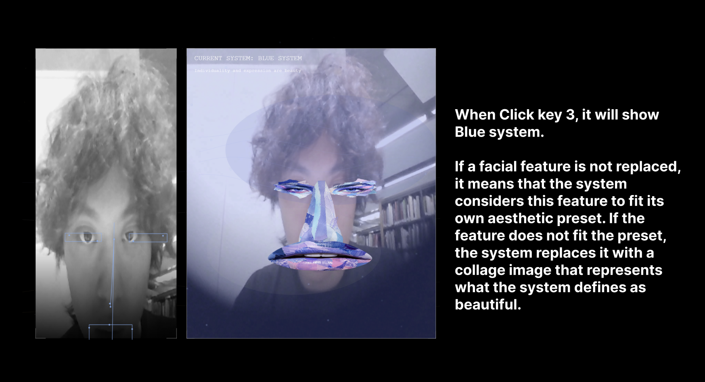


### what features and classifier are you using?

1, I chose brightness, saturation, contrast and colour difference because the Blue System focuses on individuality, expression, colour and visual intensity.

2, I chose the ml5 neuralNetwork classifier because it is suitable for classifying expressive / not_expressive images using simple numerical features.

````
ml5.neuralNetwork(...)
brain.addData(...)
brain.train(...)
brain.classify(...)

````

<a id="yellow-system-feature-comparison"></a>
## 9, 🟨 5 June / 7 - 9 June Yellow System: Dataset Preparation and Feature Comparison

### After completing the Blue System classification model training, I began developing the Yellow System. Similar to the Blue System, the Yellow System also uses an ml5 neuralNetwork classification model, but it represents a completely different aesthetic preset.

The Yellow System defines “beauty” through a natural, soft, clean and minimal visual style.

Therefore, I prepared a new small image dataset for the Yellow System and divided the images into two categories: natural and not_natural. Each category contained approximately 20 images.

> **Note:** All images in the Blue System and Yellow System training datasets were generated using AI image generation tools. I created them by writing prompts based on each system’s aesthetic preset and, in some cases, providing reference images to guide the visual style. After generation, I selected and labelled the images according to the logic of each system, such as expressive / not_expressive for the Blue System and natural / not_natural for the Yellow System. 
>

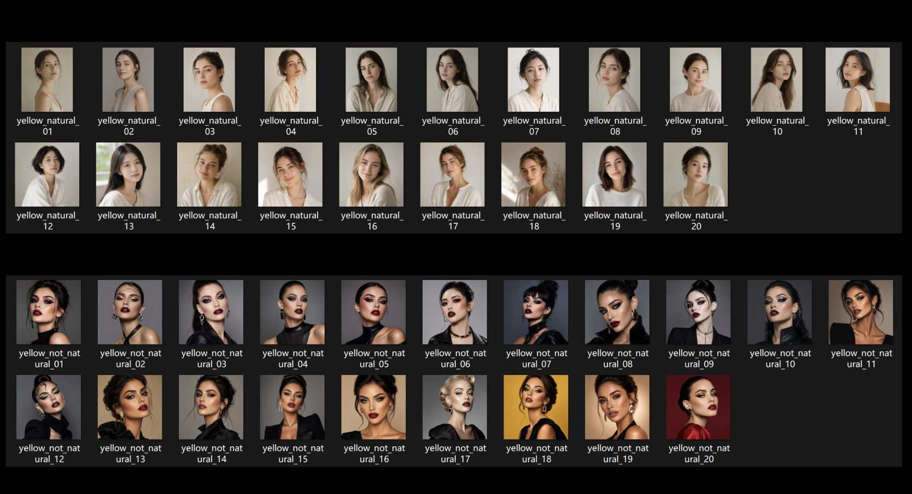

This stage also connects to the course and project requirement of data selection and preparation. For the Yellow System, the choice of dataset was very important, because “natural” is not an absolute standard, but an aesthetic rule that I defined for this system. In other words, the model was not learning true natural beauty. It was learning the Yellow System preset that I created through selected images and labels.

### Technically, I continued to use simple image features to train the classification model. To help the Yellow System distinguish between natural and not_natural images, I extracted visual features such as brightness, saturation, contrast and colour difference.

These features are connected to the aesthetic logic of the Yellow System. For example, natural images usually have softer lighting, lower saturation, less decoration and a cleaner visual style, while not_natural images often have stronger make-up, stronger colours, higher contrast or a more stylised appearance.

During this process, I conducted a simple comparison experiment to find a more effective way of training the Yellow System classifier.

Similarly, in the first experiment, I used only brightness and saturation as the input features.

In the second experiment, I added contrast and colour difference and trained the model using all four features.

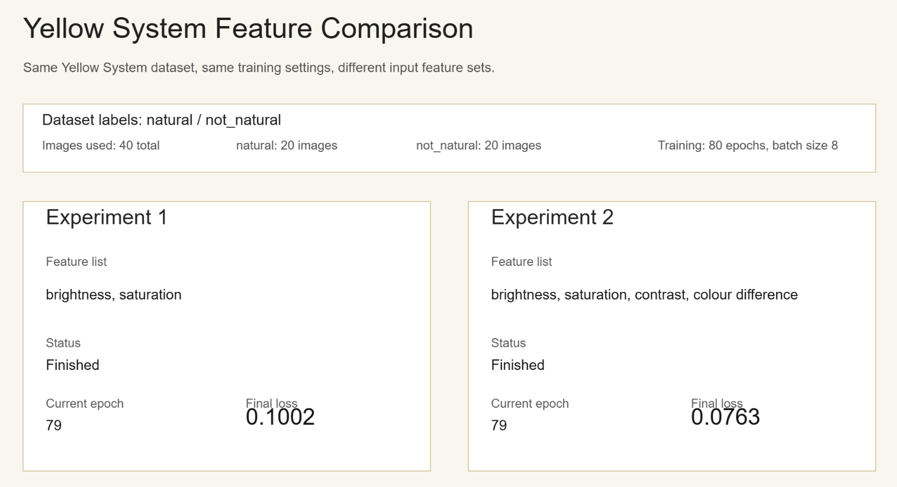

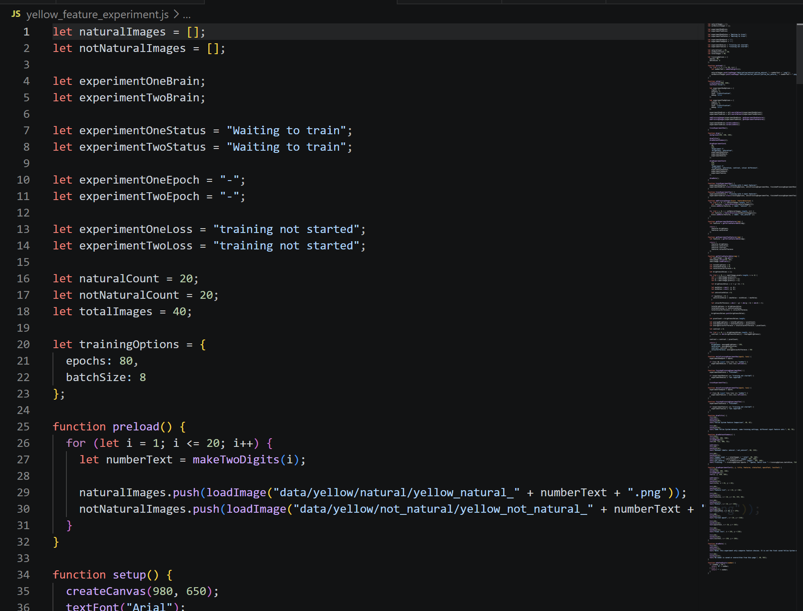


By comparing the training results of the two experiments, I found that, similar to the Blue System, the four-feature version was more stable. Experiment 1 used only brightness and saturation, with a final loss of 0.1002. After adding contrast and colour difference in Experiment 2, the final loss decreased to 0.0763. Therefore, I chose brightness, saturation, contrast and colour difference as the input features for the Yellow System classifier.

**This choice also better reflects the Yellow System’s aesthetic logic of naturalness, softness, lower saturation and a minimalist visual style.**


<a id="yellow-classifier-webcam-test"></a>
## 10, 🟨 6 June / 7 June Yellow System: Classifier Training and Webcam Test

### At this stage, I completed the Yellow System model training, similar to the Blue System, and then carried out a live webcam test.

**The training process of the Yellow System classifier (same as blue ststem tech)**


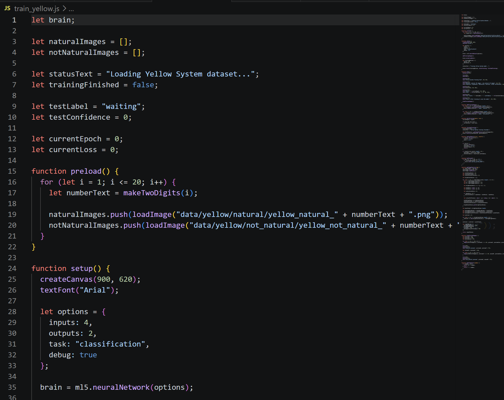

**After training the classifier, I carried out a live webcam test**

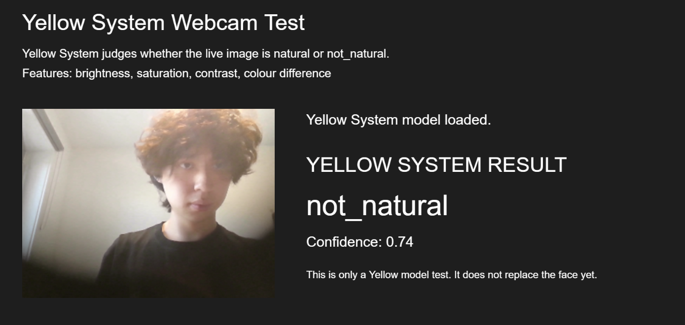

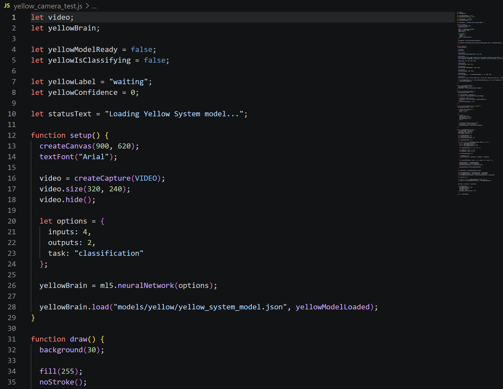


When the Yellow System classifies the live camera image as not_natural, meaning that the result does not match its natural beauty preset, the system triggers a corresponding collage-style visual replacement and replaces the user’s facial features.

It is important to note that not_natural does not mean that the user is “not beautiful”. It simply means that the current image does not match the Yellow System’s preset of natural, soft and minimalist beauty. Therefore, the purpose of the visual replacement is not to evaluate the user, but to demonstrate how a system can reinterpret the same face according to its own rules.

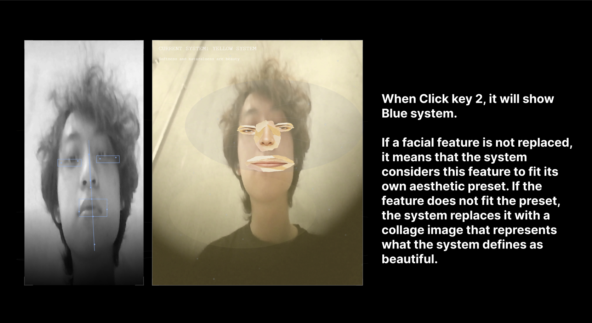

### what features and classifier are you using?

1, I chose brightness, saturation, contrast and colour difference because the Yellow System focuses on naturalness, softness, lower saturation, a clean visual style and minimal decoration.

2, The Yellow System and the Blue System use a similar technical structure, but their datasets, labels and aesthetic presets are different. Therefore, even when using a similar classifier, different systems can still produce different aesthetic judgements.


<a id="three-system-integration"></a>
## 11, 🟧 11 June / 12 June Three-System Integration and Interface Refinement

**After completing the separate technical tests for the Black System, Blue System and Yellow System, I started integrating the three systems into one final interface. At this stage, the focus was no longer on training or testing each model separately, but on making the three systems work together at the same time.**

**In the final interface, I also incorporated UI design elements, including textual information and visual cues, to help users understand how to interact with the system and interpret the data and classification results it presents. Through this approach, users can better understand both the functionality of the system and the core ideas explored by the project. I hope this work is not only a trained machine learning model, but also an interactive experience prototype that encourages users to think critically.**

[▶ Watch video](../../Engineering-Files/Beauty-Has-No-Definition/casebook-media/videos/1b158009-80ab-4017-aee3-6778866d39d0.mp4)

### Technically, the Black System uses FaceMesh for facial feature detection and rule-based judgement, while the Blue System and Yellow System use the trained ml5 neuralNetwork classification models. After integration, users can stand in front of the camera and use keys 1, 2 and 3 to change the order of the three systems in the interface, allowing them to see how the same face can be reinterpreted by different aesthetic presets.

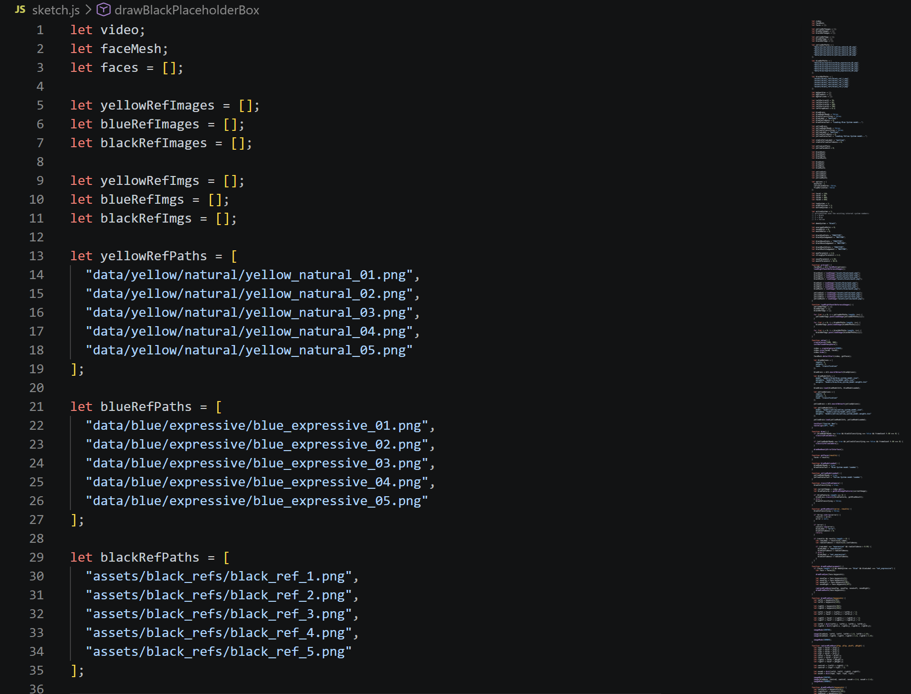


### Through this interaction, I wanted users to realise that beauty does not have a fixed definition. A person should not be limited by the judgement of a computer algorithm or by other people’s standards of beauty. Instead, beauty should be understood as something personal, flexible and self-defined.

This stage also encouraged me to think more about the final visual presentation of the work. To make the interface more than just a technical testing page, I added a more complete visual design, including system titles, colour-coded sections, status text, reference images and a clearer layout structure. These visual elements help the audience understand which system is currently running and allow the work to function as a complete interactive project.

The aim of this stage was to turn the previously separate technical tests into a single integrated prototype. By bringing the three systems together, I was able to demonstrate the core logic of the project more clearly: the same face can be judged and transformed differently by different systems.

**This stage also made me realise that the final interface not only needed to function technically, but also needed to be visually clear and easy for the audience to understand and interact with.**


<a id="test-set-evaluation"></a>
## 12, 🟩 16 June — Tutor Feedback and Test Set Evaluation

Over the past few days, I paused the EMI final project because I needed to submit my Making assignment. On 16 June, I had a conversation with Rebecca about my final project. She confirmed that my project direction and current demo were in line with the EMI final project requirements, but also reminded me that I needed to explain more clearly in my weblog and README how the project addresses the criteria, especially which features and classifier I used, and how I evaluated the model.

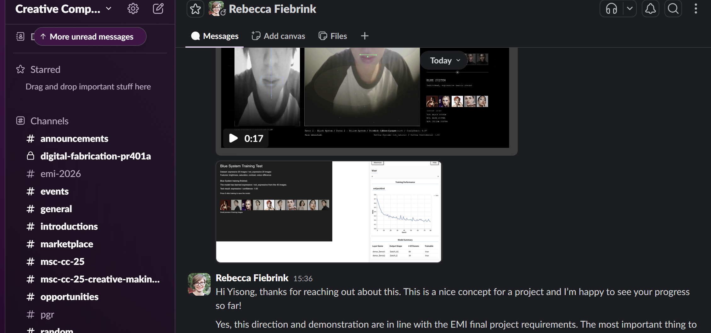

Through this feedback, I realised that I had mainly documented the model training process and webcam tests, such as training loss and whether the model could connect to live camera input. However, I had not yet added a proper test set accuracy evaluation. In other words, I had not tested the classifier’s performance using new images that the model had not seen during training.

Therefore, after the main prototype was mostly completed, I decided to add this evaluation step. This test was not intended to change the final interface, but to evaluate the performance of the Blue and Yellow classifiers more clearly. I prepared a set of test images that had not been used during training, and asked the models to classify these new images in order to check whether they could make reasonable predictions on unseen examples.

This process made me realise more clearly that training results and webcam tests only show that the model can be trained and run. Test set accuracy, however, gives a better indication of whether the model has some ability to generalise to new examples. Although my dataset is still small and this test is only a simple additional experiment, it helped me respond more directly to my tutor’s feedback and made the project process more complete.

This stage was not about rebuilding the project, but about adding an evaluation step to the existing prototype. It helped me further understand that a machine learning project should not only show the final output, but also explain the relationship between data, features, classifier and evaluation.

### I then carried out test set accuracy evaluations for both the Blue System and the Yellow System separately.

**Blue System**

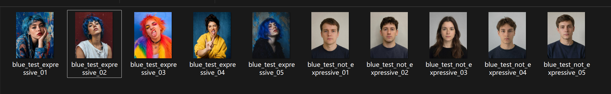
fig. Image for test


fig. test

**Yellow System**

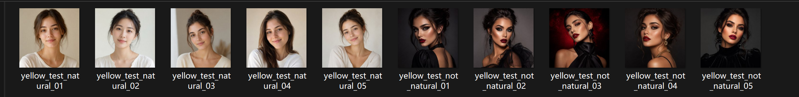
fig. Image for test

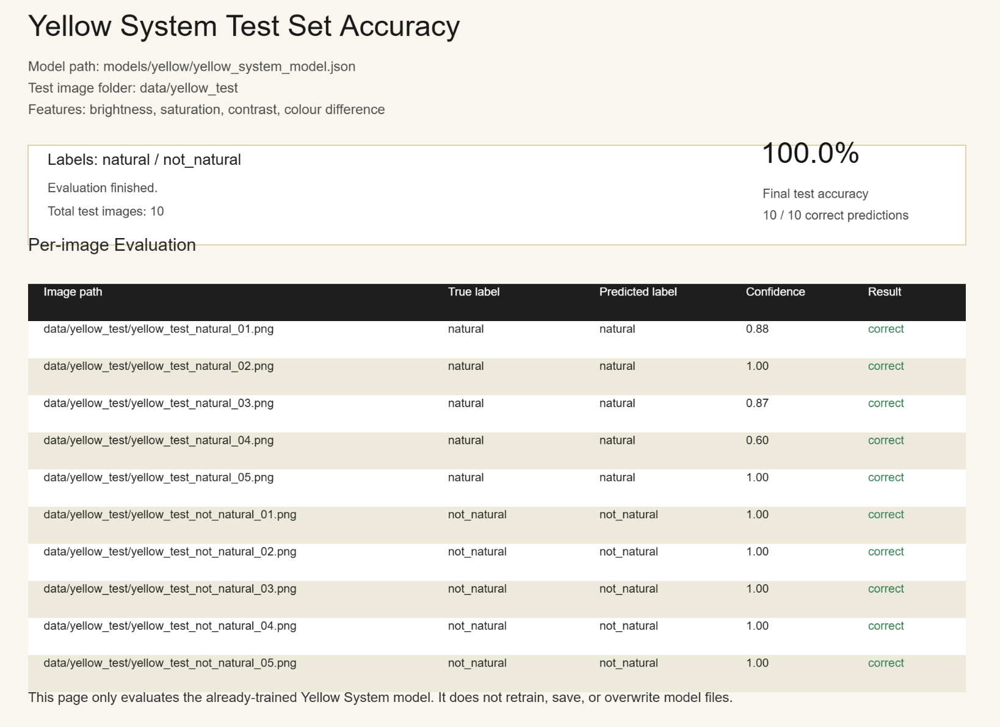
fig. test

### Through the test set evaluation, the Blue System achieved an accuracy of 70%, while the Yellow System achieved 100% accuracy on ten test images that had not been used during training.

These results suggest that both classifiers were able to respond to unseen images, although the Blue System still showed some limitations in its ability to generalise.

### Most of the Yellow System predictions had relatively high confidence scores. However, one natural image only achieved a confidence score of 0.60, indicating that the model made the correct prediction but was less confident when classifying this particular image.

### Although the Blue System still had some limitations, 70% accuracy shows that the classifier was still effective to some extent and could respond meaningfully to new images.

### However, I think that as the datasets are relatively small and contain only around 20 images per category. So, the selected features are also simplified representations of visual appearance and cannot fully describe complex ideas such as beauty, expression or individuality. 

### Therefore, the classifiers should be understood as artistic and critical demonstrations rather than objective beauty evaluation systems.


<a id="code-learning-sources-and-code-comments"></a>
## 14, 🟩 Code Learning Sources and Code Comments

At this stage, I added a separate section to explain the learning sources behind my main code `sketch.js`. I wanted to make the coding process clearer, so the reader can understand how I learned each technical part, which external resources supported the code, and how these resources were adapted into my own project.

This section is not a new technical test. Instead, it is a documentation step. It helps explain the relationship between my code, the EMI course content, external tutorials, official documentation and my own project decisions. I also added explanatory comments directly inside `sketch.js`, so the main technical parts of the code are easier to understand.

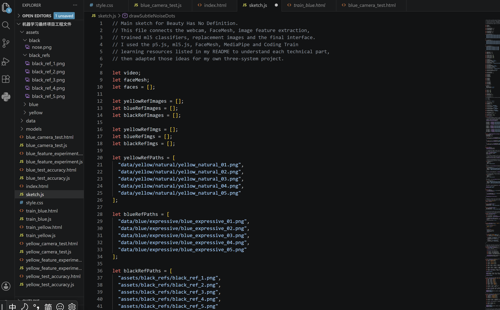

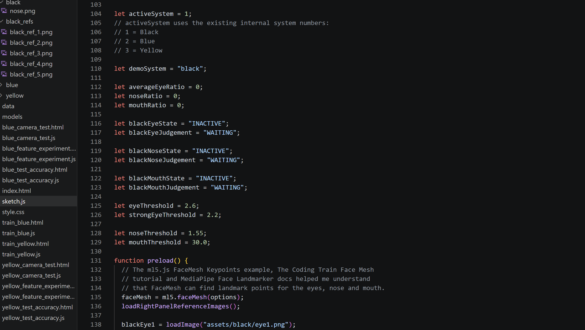


### Code Learning Sources for `sketch.js`

The main `sketch.js` file was developed by learning from several external technical resources and adapting them to my own project structure. These resources helped me understand specific coding methods, but the final three-system structure, aesthetic presets, feature choices, visual replacement logic and interface design were developed for my own project.

For the live camera input, I used the **p5.js Video Capture example** to understand how to use `createCapture(VIDEO)` and draw webcam input onto the canvas. This helped me build the basic live portrait system used in the final interface.

For image feature extraction, I used the **p5.Image `loadPixels()` reference** to understand how to read RGB pixel data from an image. I adapted this method to calculate brightness, saturation, contrast and colour difference. These four values became the input features for the Blue System and Yellow System classifiers.

For the Black System, I used the **ml5.js FaceMesh Keypoints example**, **The Coding Train’s Face Mesh with ml5.js tutorial**, and the **MediaPipe Face Landmarker documentation** to understand how facial landmark detection works. I then selected specific keypoints for the eyes, nose and mouth, and used them to create my own rule-based judgement system.

For the Blue System and Yellow System classifiers, I used the **ml5.js documentation** and **ml5.js Learn** resources to understand how machine learning models can run in a browser-based p5.js project. I also referred to **The Coding Train’s Pose Classifier with `ml5.neuralNetwork()` tutorial**. Although that tutorial uses pose data rather than image features, it helped me understand how extracted numerical values can be used as input features for a classifier. I adapted this structure for my own image-based classifiers.

I have also added explanatory comments directly inside `sketch.js`. These comments mark the main technical sections of the code and show which learning resources helped me understand each part, such as webcam input, FaceMesh landmark detection, image feature extraction and ml5 neuralNetwork classification.

The other training, testing and evaluation files were mainly used during different development stages, such as training the Blue and Yellow classifiers, testing webcam input, comparing feature sets, and carrying out test set accuracy evaluation. 

These files helped me build the final system step by step. However, the main logic needed for the final interactive prototype, including webcam input, FaceMesh detection, classifier loading, feature extraction and visual replacement, is shown in the final `sketch.js` file. Therefore, this section focuses mainly on explaining `sketch.js`, while the other training, testing and evaluation files are briefly described in the repository structure section. I also added detailed explanatory comments directly inside the related scripts for each system, so the reader can understand the purpose of each file, the meaning of the different labels and features, and how the code connects to the learning sources and final project logic.


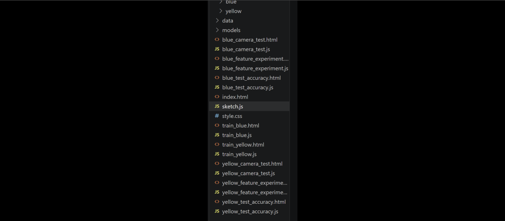

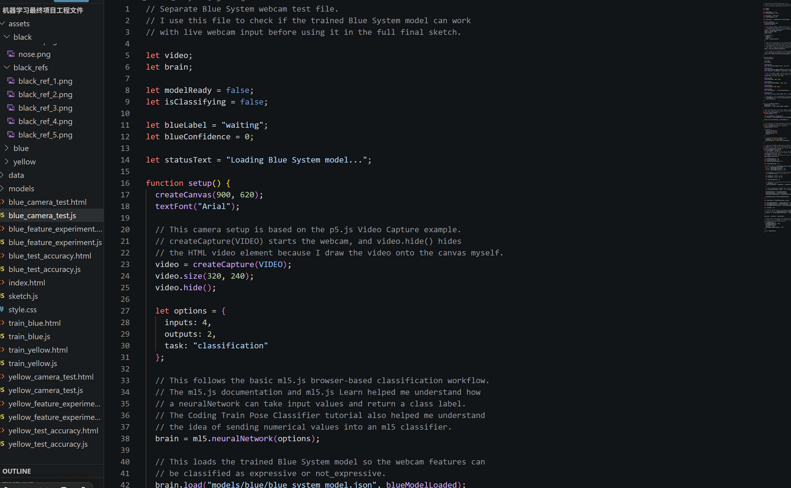

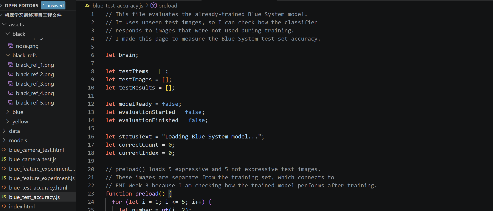

*I have added comments throughout all of the scripts to make them easier to read and review.*


## 15, 🟩 17 - 19 June — Final !!!

After completing the model training, feature comparison and test set evaluation, the main technical part of the project is now mostly finished. In the next stage, I will focus on recording the final prototype, photo the final project, the interaction with users, and organising the final written documentation. I will also review the whole project again to make sure the concept, technical process and evaluation are clearly explained before the final submission!!!!

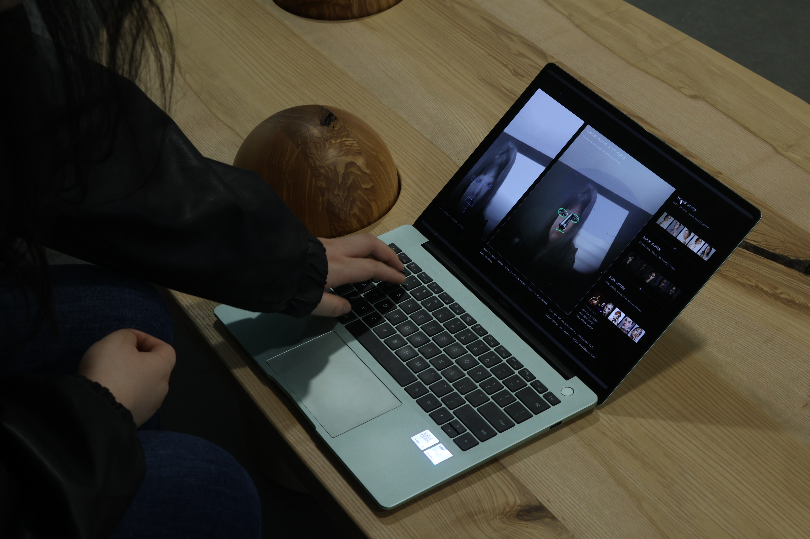

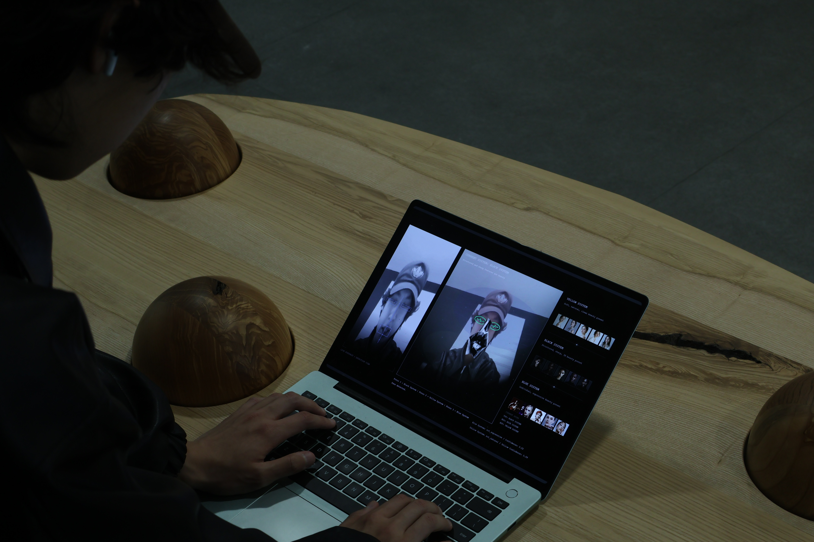

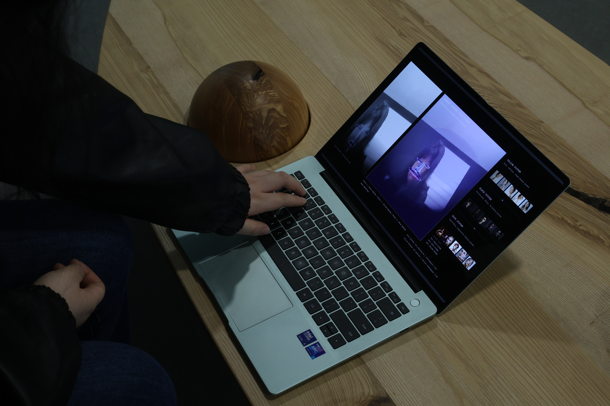

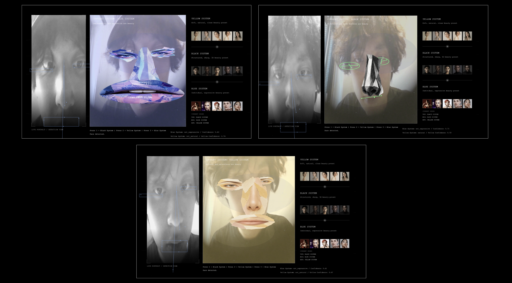

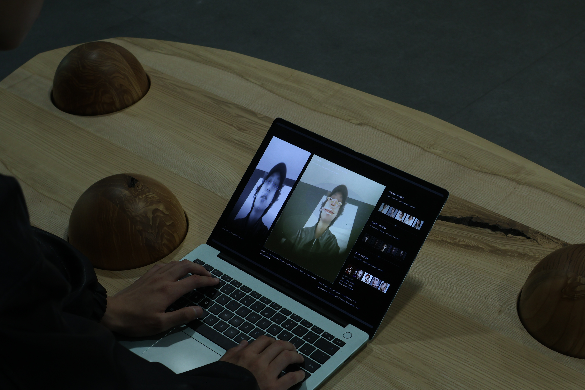

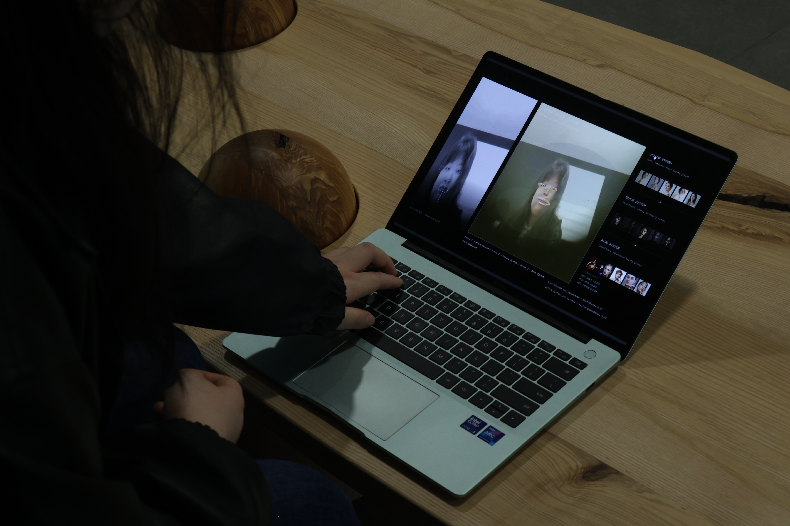


### Really happy to learn ML, a really advanced and important tech in today society!! Ye

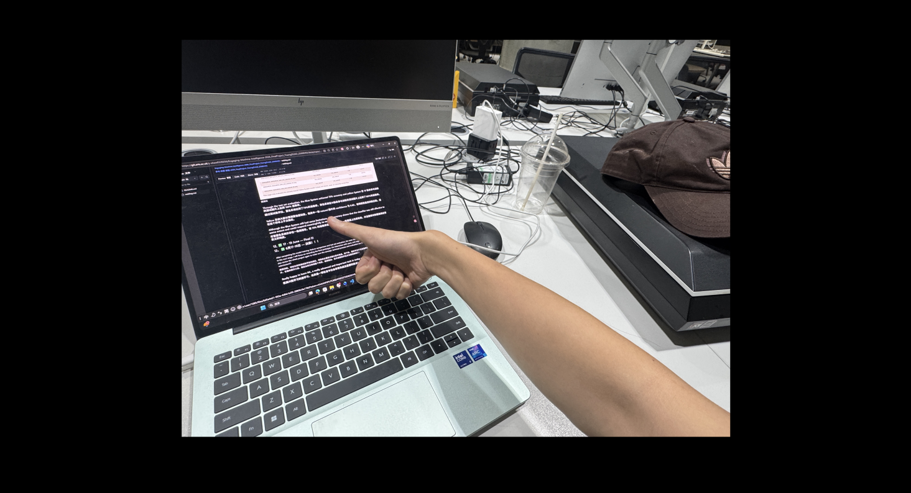
