# Sprint #2
## LLM Use Disclaimer

During the project development process, our team primarily completed the code by referencing relevant tutorials and consulting with our instructor when we encountered technical challenges. The entire project primarily relied on existing learning resources and team collaboration, without utilizing AI tools for code generation.

## Team

**Yifei Ni**

**Qiuye ZHU**

**Yisong ZHAO**

**Division of Responsibilities**

🟪 In this project, Yisong ZHAO and Qiuye ZHU were mainly responsible for the visual design, including image collection, categorisation, visual adjustment, and layout design. After completing the visual files, we handed them over to Yifei NI, who imported them into TouchDesigner and implemented the interactive system.

🟪 During the technical implementation process, we encountered a number of bugs and interaction issues that were not sufficiently clear, such as how to set appropriate data ranges and which hand gestures would be the most suitable interaction method. To solve these problems, the three members of our group spent several late nights working together through multiple rounds of testing and adjustment, gradually improving the interaction experience and system stability.

🟪 In addition, we would like to thank Tianyi MAO from our college for his assistance with the card data storage system on Screen 2. He helped us analyse the relevant parameters, suggested several modifications, and ultimately helped us resolve the issue.

🟪 Overall, this project was a highly rewarding and enjoyable collaborative experience.

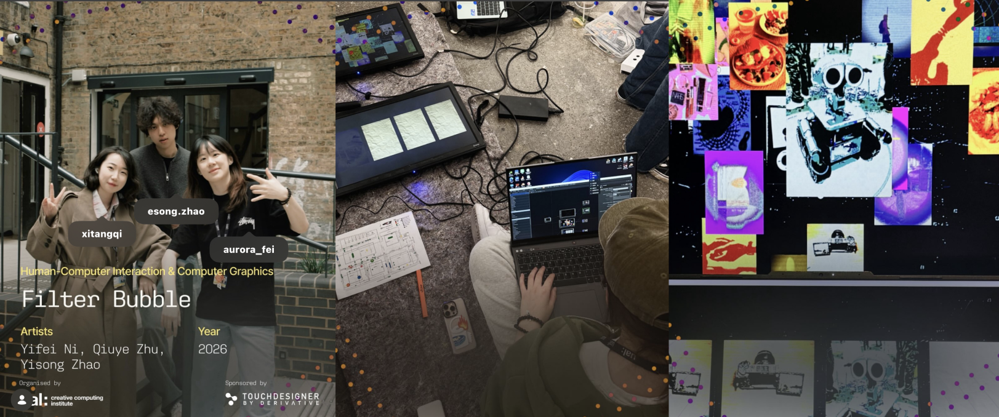

## Project Overview - Filter Bubble

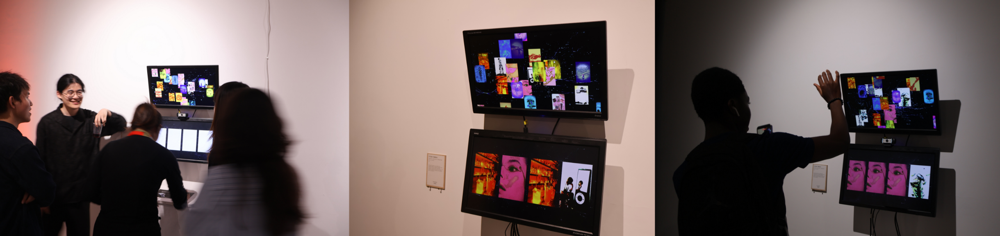

🟪 This project explores the phenomenon of the *information cocoon*, where personalised recommendation systems gradually narrow the range of information users are exposed to. On social media platforms, algorithms continuously learn from our viewing habits, likes, and interactions, then recommend increasingly similar content. While this creates a more personalised experience, it can also reduce opportunities to encounter unfamiliar perspectives, topics, and ideas.

🟪 The project aims to encourage audiences to reflect on how recommendation systems shape their perception of the world. Rather than presenting information diversity, platforms often reinforce existing preferences, creating a closed loop of repeated interests and viewpoints.

🟪 Visually, the installation is built around six popular content categories commonly found on social media platforms, such as sport, travel, relationships, entertainment, news, and lifestyle. Each category is represented by a distinct colour and displayed as a collection of images on screen, forming a visually diverse information environment.

🟪 Users interact with the system through hand gestures. An open hand allows users to browse and select content, while a pinch gesture confirms their choice and moves the selected image into a collection area at the bottom of the screen. As users continue selecting content based on personal preference, they gradually notice that the images they choose become increasingly similar in colour and category. Although the interface initially presents a wide variety of information, the user's own choices slowly reduce this diversity.

🟪 By translating algorithmic recommendation processes into a visual and interactive experience, the project makes the invisible mechanisms of content filtering visible. The work does not criticise personal interests themselves; instead, it questions how digital platforms amplify existing preferences and encourage users to remain within familiar information spaces.

Through this interaction, the project invites audiences to consider a critical question: when we continuously consume content we already enjoy, are we actively exploring information, or are we gradually becoming confined within a personalised information cocoon?

## Interaction Method

🟪 **Step 1, Open-hand Gesture**

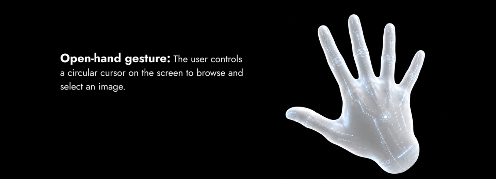    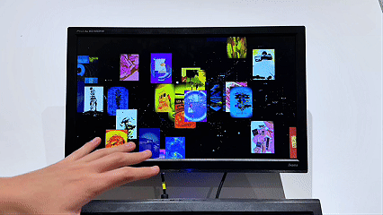

🟪 **Step 2, Closed-hand Gesture**

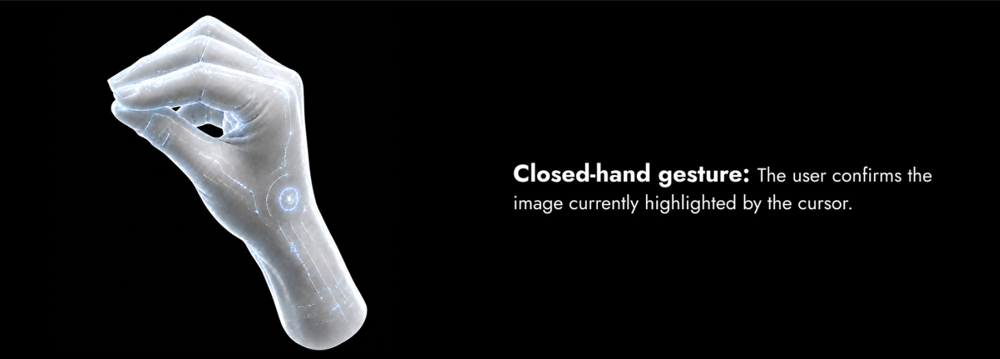    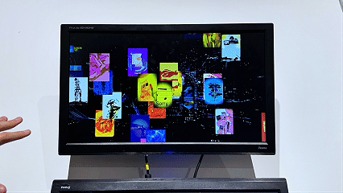

🟪 **Step 3, The selected image will be moved into the collection area at the bottom of the screen**

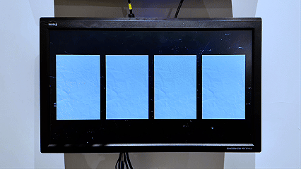

**Users will eventually notice that most of their selected images share similar colours, indicating a concentration around a particular preference. Through this process, we aim to make the formation of an information cocoon visible and encourage reflection on the impact of recommendation algorithms on information diversity.**

## Technology Part
**The top section is for browsing and selecting, while the bottom section is for saving and displaying.**

The overall technical workflow includes: MediaPipe hand tracking → pinching distance detection → Logic CHOP to convert the selection signal → Replicator to generate a set of images → CHOP Execute DAT to read the cardid → Switch TOP to call the associated image → Hold CHOP to save the image → the database interface below displays the selected image.

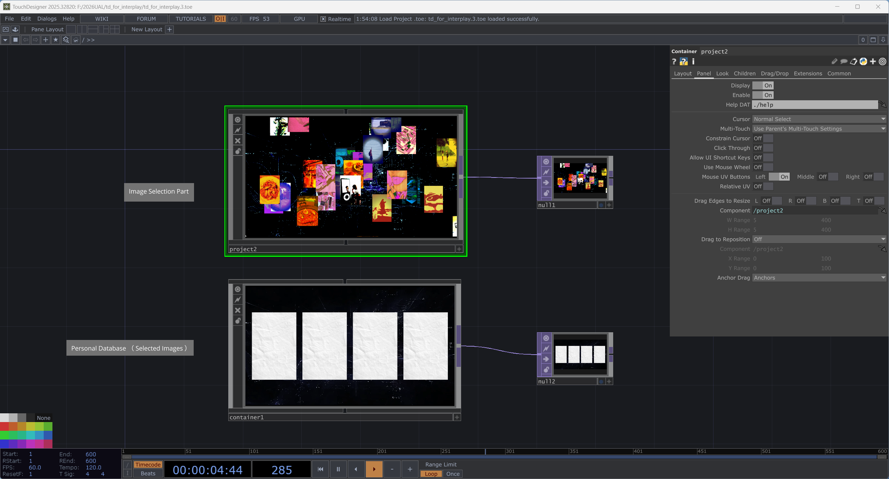

The input section uses MediaPipe for hand tracking, reading the user’s hand keypoint data—primarily detecting the positions of the thumb and index finger tips—and computing the distance between the two points. When the distance falls below a defined threshold, the system detects the user's “pinch” gesture and uses this gesture as the trigger for image selection.

Next, the data output by MediaPipe is converted into a CHOP signal → Logic CHOP is used to convert the values into 0/1 switch signals, where 0 indicates the trigger is not activated and 1 indicates the selection is triggered. When the signal from the Logic CHOP changes from 0 to 1, the CHOP Execute DAT executes a script to read the card ID of the currently selected image.

The image gallery display is created using a Replicator COMP. First, the image parameters are defined; then, the Replicator automatically generates multiple image cards based on the table contents. Each card has a unique card ID and corresponds to an image in the library.

(Reference - Yingyu Classroom: Tutorial on Gesture-Controlled Tarot Cards：https://b23.tv/GW0IY8V &  https://www.bilibili.com/video/BV1N92GBZEiS/?share_source=copy_web)

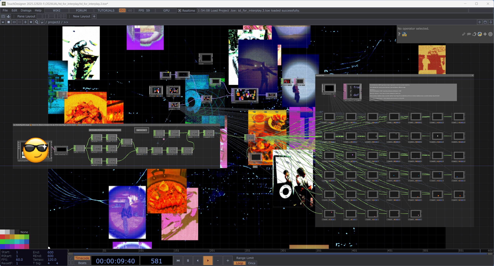
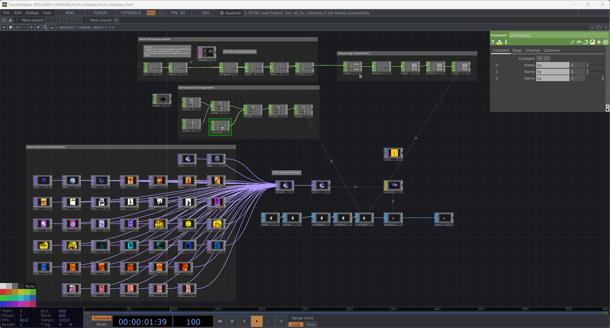

The image loading section is handled by a Switch TOP. The Switch TOP uses an index value to determine which image is currently displayed, so the cardid is used to control the Switch TOP’s index. When the user selects an image, the system switches to the correct image based on its cardid.

The data storage is handled by the Hold CHOP. Since the gesture trigger is an immediate signal, the Hold CHOP saves the cardid of the selected image. The Switch TOP is then used to call the image again, and the Transform TOP adjusts its position and size. Finally, the Composite TOP composites the image into the final display.

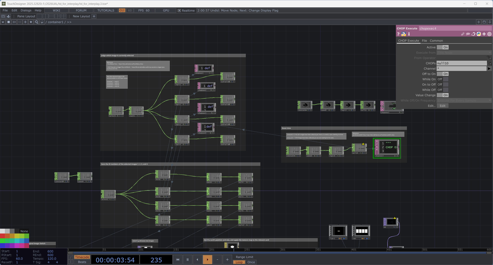
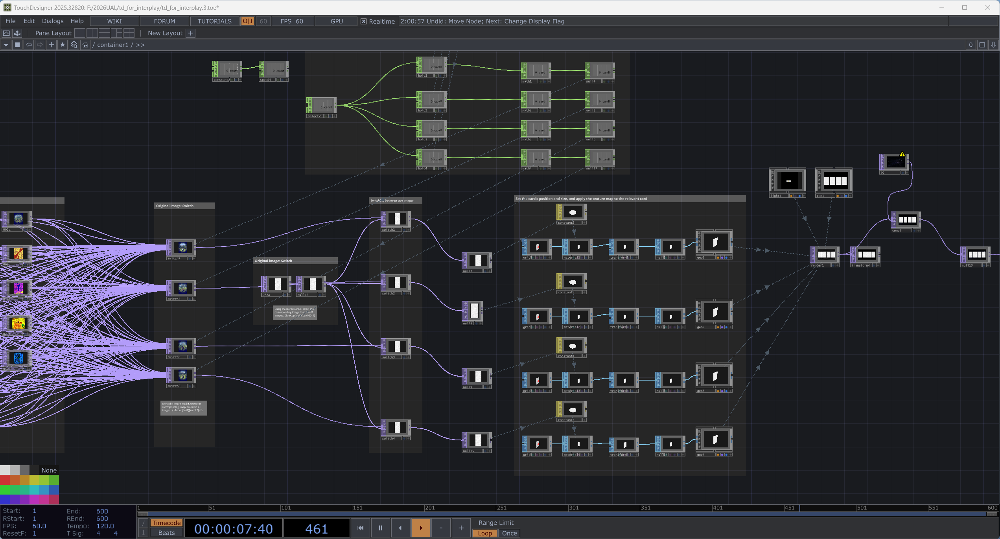

## Final Outcome Video
https://git.arts.ac.uk/user-attachments/assets/2ff22ea8-3aa8-4b84-8761-8dd39a6ec113

YouTube link：https://www.youtube.com/watch?v=OSmqiIDeZd0

## User Test
**From the demo day**
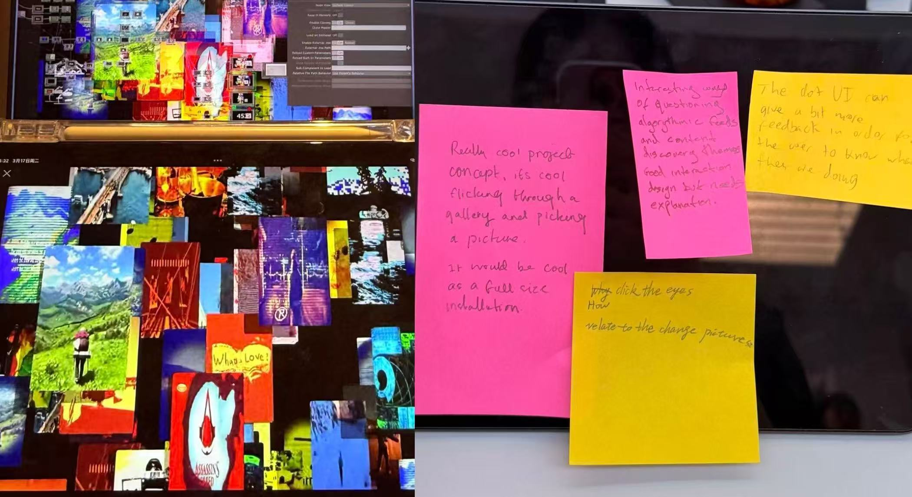
During the demo day, we used the MediaPipe plugin to test various gesture inputs, such as opening the hand, giving a thumbs-up, pinching, and blinking. However, we found that too many gestures actually increased the complexity of the operation. Some users focused on “how to trigger the gesture” and “what effect this action would produce,” rather than on the project’s main themes of image selection and personal databases. Consequently, we realized that the interaction should not merely highlight technical capabilities but should serve the overall user experience.

Based on feedback from our teacher and classmates, we ultimately decided to retain only the “pinch” gesture. This gesture is technically more stable because MediaPipe can trigger the selection by detecting the distance between the thumb and index finger tips. Additionally, the pinch action more closely resembles the act of “picking up” or “selecting,” making it easier for users to understand its relationship to selecting an image.

For interface design, the original single-screen version only showed the process of browsing and selecting images, but did not clearly indicate which images had been selected, resulting in unclear feedback. Therefore, we later added a second screen: the upper screen displays the image collection and facilitates selection, while the lower screen shows the selected images. This modification allows users to directly see the results from “selection” to “collection,” and brings the entire system closer to a complete personal image database.

## Critical reflection

In this project, my work first focused on the main visual direction of the piece, including image collection, categorisation, visual adjustment and interface layout. At the same time, I also took part in the later implementation of the spatial interaction and camera-based gesture interaction, helping the team connect the visual system with the TouchDesigner interaction system. This process made me realise that visual design in an interactive project is not only about making the screen look good, but also about how the visual system supports users’ body movements, interaction feedback and understanding of the project concept.

Compared with some of my previous projects, this project made me more aware of the importance of implementation. A strong visual direction is important, but visual design only truly works when users can understand the project through interaction.

This was also my first time using TouchDesigner and camera-based gesture interaction. I found this form of spatial interaction very interesting, because users no longer interacted only through a mouse or keyboard, but through body movement. This also gave the work a stronger sense of technology and immersion.

During the exhibition, we noticed some interaction issues, such as unclear gestures and insufficient feedback. Afterwards, I discussed these problems with my group members, and we adjusted the interaction and interface on the second day. This process helped me understand that interactive work is not completed in one attempt, but needs continuous testing and iteration. It also developed my ability to observe users, collaborate with teammates, and improve the work based on real feedback.

## Files
All the file links we’ve provided are too large to upload to GitHub, so we’ve had to share them using Google Drive ink instead.
We really apologize for any inconvenience. If you have trouble opening any of the files, please let me know. Thank you.

Sprint2 Project File(from Google Drive):https://drive.google.com/drive/folders/1JTVC8TTIXoGXS65W2edp7DAJ29SFqbwt?usp=sharing

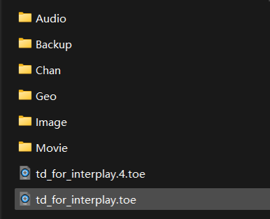
 

## References
Derivative. (n.d.). Replicator COMP. Available at: https://docs.derivative.ca/Replicator_COMP [Accessed 5 May 2026].\
Derivative. (n.d.). ReplicatorCOMP Class. Available at: https://docs.derivative.ca/ReplicatorCOMP_Class [Accessed 5 May 2026].\
Derivative. (n.d.). PanelValue Class. Available at: https://docs.derivative.ca/PanelValue_Class [Accessed 5 April 2026].\
Derivative. (n.d.). Panel Execute DAT Class. Available at: https://docs.derivative.ca/PanelexecuteDAT_Class [Accessed 5 April 2026].\
Derivative Forum. (2022). CHOP Execute to trigger Play onOfftoOn. Available at: https://forum.derivative.ca/t/chop-execute-to-trigger-play-onofftoon/314143 [Accessed 5 April 2026].\
Derivative Forum. (2024). How to connect a replicant output to another replicant input? Available at: https://forum.derivative.ca/t/how-to-connect-a-replicant-output-to-another-replicant-input/521223/4 [Accessed 5 May 2026].\
Derivative Forum. (2021). Reference OP using me.digits. Available at: https://forum.derivative.ca/t/reference-op-using-me-digits/241355 [Accessed 5 May 2026].\
Yingyu Classroom. (n.d.). Tutorial on Gesture-Controlled Tarot Cards. Bilibili. Available at: https://www.bilibili.com/video/BV1N92GBZEiS/?share_source=copy_web [Accessed 15 February 2026].\
Tapper, D. (n.d.). Replicators in TouchDesigner. YouTube. Available at: https://www.youtube.com/watch?v=mfs3yrtVl9s [Accessed 5 May 2026].
